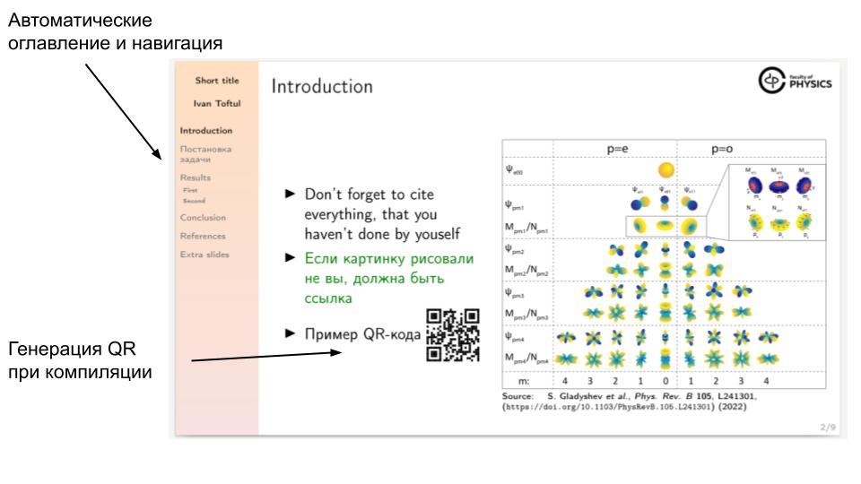
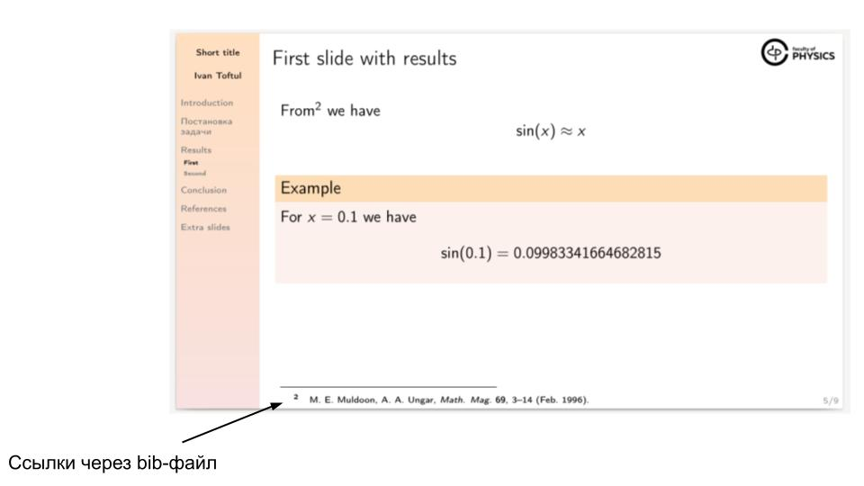

# Шаблон Нового Физтеха для презентаций в LaTeX/Beamer

Это не оффициальный шаблон.

## Примеры слайдов

## Почему стоит попробовать его использовать?

Плюсы:
- Он всё сделает за вас - ссылки, оглавление, и даже сгенерирует QR-коды.
- Не даст вам сделать некрасиво, скорее всего, даже если у вас совсем нет никакого эстетического чувства
- Сделан так, чтобы им было максимально легко пользоваться.
- Векторные картинки!
- Легко набирать формулы.
- Не нужно ничего выравнивать.

Минусы: 
- за тем, чтобы шрифт на картинках, да и сами картинки были не мелкие, надо следить все-таки самому.

## Использование

Компилируется с помощью pdflatexmk (по крайней мере, в TexShop) и Biber (не BibTeX!).

Настоятельно советую использовать расширения BibItNow! для пополенения `references.bib` файла. Расширение доступно для [chrome-based](https://chrome.google.com/webstore/detail/bibitnow/bmnfikjlonhkoojjfddnlbinkkapmldg?hl=en-US) и [firefox](https://addons.mozilla.org/en-US/firefox/addon/bibitnow/) браузеров.

## Авторы

Иван Тофтул и Кристина Фризюк.
